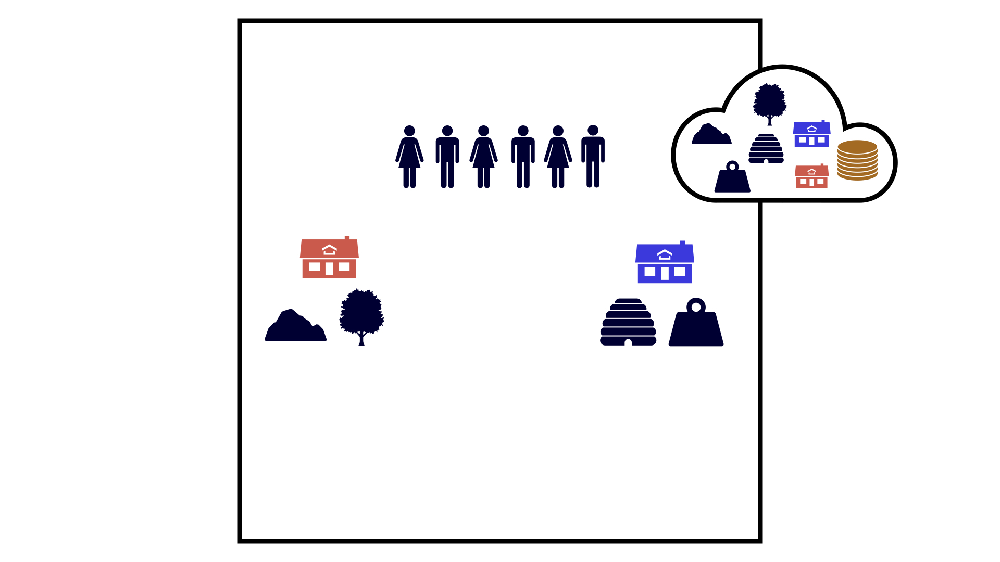

## Modified AI-Economist with Communication: A Multi-agent Reinforcement Learning Study of Evolution of Communication under Libertarian and Utilitarian Governing Systems

- [The Paper]()
- [The Results](https://github.com/aslansd/modified-ai-economist/tree/main/tutorials/Results%20(Project%201))
- [The Notebook for the Full-Libertarian Governing System](https://github.com/aslansd/modified-ai-economist/blob/main/tutorials/a_multi-agent_reinforcement_learning_study_of_libertarian_and_utilitarian_governing_systems_RLlib_FullLibertarian.ipynb)
- [The Notebook for the Semi-Libertarian/Utilitarian Governing System](https://github.com/aslansd/modified-ai-economist/blob/main/tutorials/a_multi-agent_reinforcement_learning_study_of_libertarian_and_utilitarian_governing_systems_RLlib_SemiLibertarianUtilitarian.ipynb)
- [The Notebook for the Full-Utilitarian Governing System](https://github.com/aslansd/modified-ai-economist/blob/main/tutorials/a_multi-agent_reinforcement_learning_study_of_libertarian_and_utilitarian_governing_systems_RLlib_FullUtilitarian.ipynb)
- [The Notebook for Generating the Plots of the Paper](https://github.com/aslansd/modified-ai-economist/blob/main/tutorials/a_multi-agent_reinforcement_learning_study_of_libertarian_and_utilitarian_governing_systems_Plotting.ipynb)

### Abstract
Laboratory experiments have shown that communication plays an important role in solving social dilemmas. Here, by extending the AI-Economist, a mixed motive multi-agent reinforcement learning environment, I intend to find an answer to the following descriptive question: which governing system does facilitate the emer- gence and evolution of communication and teaching among agents? To answer this question, the AI-Economist is extended by a voting mechanism to simulate three different governing systems across individualistic-collectivistic axis, from Full-Libertarian to Full-Utilitarian governing systems. In the original framework of the AI-Economist, agents are able to build houses individually by collecting mate- rial resources from their environment. Here, the AI-Economist is further extended to include communication with possible misalignment –a variant of signaling game –by letting agents to build houses together if they are able to name mutually com- plement material resources by the same letter. Moreover, another extension is made to the AI-Economist to include teaching with possible misalignment –again a variant of signaling game –by letting half the agents as teachers who know how to use mutually complement material resources to build houses but are not capable of building actual houses, and the other half as students who do not have this information but are able to actually build those houses if teachers teach them. I found a strong evidence that collectivistic environment such as Full-Utilitarian system is more favourable for the emergence of communication and teaching, or more precisely, evolution of language alignment. Moreover, I found some evidence that evolution of language alignment through communication and teaching under collectivistic governing systems makes individuals more advantageously inequity averse. As a result, there is a positive correlation between evolution of language alignment and equality in the society.

<p align="center">
  
</p>

## Installation Instructions

This package was installed and tested in Windows 10 Pro. To install this package from the source, you'll need to have Python 3.7 installed:

1. Clone this repository to your local machine:

 ```
   git clone www.github.com/aslansd/modified-ai-economist-wt
 ```

2. Create a new conda environment (named "modified-ai-economist-wt" below - replace with anything else) and activate it:

```pyfunctiontypecomment
   conda create --name modified-ai-economist-wt python=3.7 --yes
   conda activate modified-ai-economist-wt
```

3. Install as an editable Python package

```pyfunctiontypecomment
   cd modified-ai-economist-wt
   pip install -e .
```

## Testing your Install

To test your installation, try running:

```
conda activate modified-ai-economist-wt
python -c "import modified_ai_economist_wt"
```